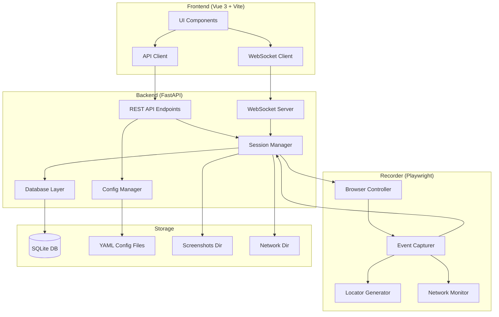

# Design Document: Web Session Recorder

## Overview

The Web Session Recorder is a full-stack application that captures browser interactions and stores them in a structured database. The system follows a clean separation between frontend (Vue 3), backend (FastAPI), and browser automation (Playwright). Configuration is externalized to YAML files for easy customization without code changes.

The architecture emphasizes:
- Real-time event streaming via WebSocket
- Incremental database persistence
- Multiple locator strategy generation for robust element identification
- Flexible privacy controls
- Configuration-driven behavior

## Architecture

### High-Level Architecture



### Technology Stack

**Frontend:**
- Vue 3 (Composition API)
- Vite (build tool)
- Element Plus (UI components)
- Axios (HTTP client)
- WebSocket API (real-time communication)

**Backend:**
- Python 3.11+
- FastAPI (web framework)
- SQLAlchemy (ORM)
- Pydantic (data validation)
- Playwright (browser automation)
- PyYAML (configuration parsing)
- WebSockets (real-time streaming)

**Database:**
- SQLite (embedded database)

**Configuration:**
- YAML files in config/ directory

## Components and Interfaces

### 1. Frontend Components

#### 1.1 Home Page Component
- **Purpose**: Start/stop recording sessions
- **Features**:
  - URL input field (optional)
  - Browser selection dropdown
  - Incognito mode toggle
  - User data directory input
  - Start/Stop recording buttons
  - Real-time event counter
- **API Calls**:
  - POST /api/sessions/start
  - POST /api/sessions/{id}/stop
  - WebSocket connection to /ws/sessions/{id}

#### 1.2 Session List Component
- **Purpose**: Display all recorded sessions
- **Features**:
  - Paginated table of sessions
  - Columns: run_id, start_url, start_time, duration, event_count, status
  - Click to view details
  - Filter by date, browser, status
- **API Calls**:
  - GET /api/sessions

#### 1.3 Session Detail Component
- **Purpose**: View detailed session information and events
- **Features**:
  - Session metadata display
  - Event timeline (chronological list)
  - Event detail viewer (expandable)
  - Locator display for each event
  - Network request/response viewer
  - Screenshot gallery (if available)
- **API Calls**:
  - GET /api/sessions/{id}
  - GET /api/sessions/{id}/events

#### 1.4 Settings Component
- **Purpose**: Edit configuration files
- **Features**:
  - Tabbed interface for each config file
  - YAML editor with syntax highlighting
  - Validation before save
  - Reset to defaults button
- **API Calls**:
  - GET /api/config
  - PUT /api/config

### 2. Backend Components

#### 2.1 REST API Endpoints

```python
# Session Management
POST   /api/sessions/start
  Request: {
    "url": "string | null",
    "browser": "chrome | edge | firefox",
    "incognito": "boolean",
    "user_data_dir": "string | null"
  }
  Response: {
    "session_id": "string",
    "status": "started"
  }

POST   /api/sessions/{id}/stop
  Response: {
    "session_id": "string",
    "status": "stopped",
    "event_count": "integer"
  }

GET    /api/sessions
  Query: page, page_size, filter
  Response: {
    "sessions": [Session],
    "total": "integer",
    "page": "integer",
    "page_size": "integer"
  }

GET    /api/sessions/{id}
  Response: Session

GET    /api/sessions/{id}/events
  Query: page, page_size
  Response: {
    "events": [Event],
    "total": "integer"
  }

# Configuration Management
GET    /api/config
  Response: {
    "app": "object",
    "browser": "object",
    "recorder": "object",
    "database": "object",
    "locators": "object"
  }

PUT    /api/config
  Request: {
    "file": "app | browser | recorder | database | locators",
    "content": "string (YAML)"
  }
  Response: {
    "status": "success | error",
    "message": "string"
  }

# WebSocket
WS     /ws/sessions/{id}
  Messages: Event (JSON)
```

#### 2.2 Session Manager

**Responsibilities:**
- Manage session lifecycle (create, start, stop)
- Coordinate between Browser Controller and Database Layer
- Handle event streaming via WebSocket
- Manage session state

**Key Methods:**
```python
class SessionManager:
    async def create_session(config: SessionConfig) -> Session
    async def start_recording(session_id: str) -> None
    async def stop_recording(session_id: str) -> None
    async def handle_event(session_id: str, event: Event) -> None
    async def stream_event(session_id: str, event: Event) -> None
    def get_session(session_id: str) -> Session
    def list_sessions(filters: dict) -> List[Session]
```

#### 2.3 Config Manager

**Responsibilities:**
- Load YAML configuration files
- Validate configuration
- Update configuration files
- Provide configuration to other components

**Configuration Files:**
- `config/app.yaml`: Server host, port, CORS settings
- `config/browser.yaml`: Browser paths, launch options, context options
- `config/recorder.yaml`: Event types, privacy mode, network monitoring
- `config/database.yaml`: Database path, retention policy
- `config/locators.yaml`: Locator strategies, priorities

**Key Methods:**
```python
class ConfigManager:
    def load_config(file_name: str) -> dict
    def save_config(file_name: str, content: str) -> bool
    def validate_config(file_name: str, content: dict) -> bool
    def get_all_configs() -> dict
```

#### 2.4 Database Layer

**Responsibilities:**
- SQLAlchemy ORM models
- Database operations (CRUD)
- Query optimization
- Transaction management

**Key Methods:**
```python
class DatabaseLayer:
    async def create_session(session: Session) -> Session
    async def update_session(session_id: str, updates: dict) -> Session
    async def get_session(session_id: str) -> Session
    async def list_sessions(filters: dict, pagination: dict) -> List[Session]
    async def create_event(event: Event) -> Event
    async def get_events(session_id: str, pagination: dict) -> List[Event]
    async def get_config(key: str) -> str
    async def set_config(key: str, value: str) -> None
```

### 3. Recorder Components

#### 3.1 Browser Controller

**Responsibilities:**
- Launch and manage Playwright browser instances
- Create browser contexts with specified options
- Handle browser lifecycle
- Coordinate Event Capturer and Network Monitor

**Key Methods:**
```python
class BrowserController:
    async def launch_browser(config: BrowserConfig) -> Browser
    async def create_context(browser: Browser, config: ContextConfig) -> BrowserContext
    async def navigate(context: BrowserContext, url: str) -> Page
    async def inject_capturer(page: Page) -> None
    async def close_browser(browser: Browser) -> None
```

#### 3.2 Event Capturer

**Responsibilities:**
- Inject JavaScript into pages for DOM event capture
- Listen to Playwright events (navigation, dialog, download)
- Capture event details (timestamp, page context, target)
- Trigger Locator Generator for target elements
- Send events to Session Manager

**JavaScript Injection:**
```javascript
// Injected into each page/frame
(function() {
  const eventTypes = ['click', 'dblclick', 'contextmenu', 'input', 'change', 'submit', 'keydown'];
  
  eventTypes.forEach(type => {
    document.addEventListener(type, (e) => {
      const eventData = {
        type: type,
        timestamp: Date.now(),
        target: captureTargetInfo(e.target),
        page: {
          url: window.location.href,
          title: document.title,
          frame: captureFrameInfo()
        }
      };
      window.__recorder__.sendEvent(eventData);
    }, true);
  });
})();
```

**Key Methods:**
```python
class EventCapturer:
    async def inject_script(page: Page) -> None
    async def setup_listeners(page: Page) -> None
    async def handle_dom_event(event_data: dict) -> Event
    async def handle_navigation(page: Page) -> Event
    async def handle_dialog(dialog: Dialog) -> Event
    async def handle_download(download: Download) -> Event
```

#### 3.3 Locator Generator

**Responsibilities:**
- Generate multiple locator strategies for DOM elements
- Prioritize locators by stability and reliability
- Support 7 locator types: role, label, data-testid, placeholder, text, CSS, XPath

**Locator Strategies:**
1. **Role + Accessible Name**: `getByRole('button', { name: 'Submit' })`
2. **Label**: `getByLabel('Email')`
3. **Data-testid**: `getByTestId('login-button')`
4. **Placeholder**: `getByPlaceholder('Enter email')`
5. **Text**: `getByText('Click here')`
6. **CSS Selector**: `css=button.submit-btn`
7. **XPath**: `xpath=//button[@class='submit-btn']`

**Key Methods:**
```python
class LocatorGenerator:
    def generate_locators(element_info: dict) -> List[Locator]
    def generate_role_locator(element_info: dict) -> Locator | None
    def generate_label_locator(element_info: dict) -> Locator | None
    def generate_testid_locator(element_info: dict) -> Locator | None
    def generate_placeholder_locator(element_info: dict) -> Locator | None
    def generate_text_locator(element_info: dict) -> Locator | None
    def generate_css_locator(element_info: dict) -> Locator
    def generate_xpath_locator(element_info: dict) -> Locator
    def prioritize_locators(locators: List[Locator]) -> List[Locator]
```

#### 3.4 Network Monitor

**Responsibilities:**
- Capture network requests and responses
- Extract request/response details
- Apply privacy filtering based on configuration
- Store network data with events

**Key Methods:**
```python
class NetworkMonitor:
    async def setup_monitoring(page: Page) -> None
    async def handle_request(request: Request) -> NetworkRequest
    async def handle_response(response: Response) -> NetworkResponse
    def apply_privacy_filter(data: dict, mode: str) -> dict
    def should_capture_request(request: Request) -> bool
```

## Data Models

### Session Model

```python
class Session(Base):
    __tablename__ = "sessions"
    
    id = Column(Integer, primary_key=True)
    run_id = Column(String, unique=True, nullable=False)
    start_url = Column(String, nullable=True)
    start_time = Column(DateTime, nullable=False)
    end_time = Column(DateTime, nullable=True)
    status = Column(String, nullable=False)  # started, stopped, error
    browser_type = Column(String, nullable=False)  # chrome, edge, firefox
    incognito = Column(Boolean, default=False)
    event_count = Column(Integer, default=0)
    user_data_dir = Column(String, nullable=True)
    
    events = relationship("Event", back_populates="session")
```

### Event Model

```python
class Event(Base):
    __tablename__ = "events"
    
    id = Column(Integer, primary_key=True)
    session_id = Column(Integer, ForeignKey("sessions.id"), nullable=False)
    seq = Column(Integer, nullable=False)
    timestamp = Column(DateTime, nullable=False)
    event_type = Column(String, nullable=False)
    page_url = Column(String, nullable=False)
    page_title = Column(String, nullable=True)
    target_data = Column(JSON, nullable=True)
    locators = Column(JSON, nullable=True)
    network_data = Column(JSON, nullable=True)
    raw_data = Column(JSON, nullable=False)
    
    session = relationship("Session", back_populates="events")
    
    __table_args__ = (
        Index('idx_session_seq', 'session_id', 'seq'),
    )
```

### Config Model

```python
class Config(Base):
    __tablename__ = "configs"
    
    id = Column(Integer, primary_key=True)
    key = Column(String, unique=True, nullable=False)
    value = Column(Text, nullable=False)
    updated_at = Column(DateTime, nullable=False)
```

### Pydantic Models (API)

```python
class SessionConfig(BaseModel):
    url: Optional[str] = None
    browser: str = "chrome"
    incognito: bool = False
    user_data_dir: Optional[str] = None

class SessionResponse(BaseModel):
    id: int
    run_id: str
    start_url: Optional[str]
    start_time: datetime
    end_time: Optional[datetime]
    status: str
    browser_type: str
    incognito: bool
    event_count: int

class EventResponse(BaseModel):
    id: int
    session_id: int
    seq: int
    timestamp: datetime
    event_type: str
    page_url: str
    page_title: Optional[str]
    target_data: Optional[dict]
    locators: Optional[List[dict]]
    network_data: Optional[dict]

class LocatorModel(BaseModel):
    strategy: str
    selector: str
    stability: str  # high, medium, low
```

## Correctness Properties

*A property is a characteristic or behavior that should hold true across all valid executions of a system—essentially, a formal statement about what the system should do. Properties serve as the bridge between human-readable specifications and machine-verifiable correctness guarantees.*


### Property 1: Event Capture Completeness
*For any* active recording session and any user interaction (click, input, navigation, etc.), the Recorder should capture that interaction and store it as an event in the database with a sequential number.
**Validates: Requirements 2.3, 3.1, 3.2, 3.6**

### Property 2: Session Persistence Round-Trip
*For any* recording session, after stopping the session, retrieving it via GET /api/sessions/{id} should return a session object with all metadata fields (run_id, start_url, start_time, end_time, status, browser_type, incognito, event_count) matching what was recorded.
**Validates: Requirements 2.4, 2.7, 9.2, 9.4**

### Property 3: Event Data Completeness
*For any* captured event, the stored event record should contain all required fields: session_id, seq, timestamp, event_type, page_url, page_title, target_data, locators, network_data, and raw_data.
**Validates: Requirements 3.5, 3.7, 9.5**

### Property 4: Multi-Strategy Locator Generation
*For any* event that targets a DOM element, the Locator Generator should produce multiple locator strategies (attempting role, label, data-testid, placeholder, text, CSS, and XPath), with at least 2 valid locators generated.
**Validates: Requirements 3.3, 3.4**

### Property 5: Network Request Capture Completeness
*For any* network request made during a recording session, the captured network data should include request method, URL, headers, body, and response status, headers, body.
**Validates: Requirements 4.1, 4.2, 4.3, 4.4**

### Property 6: Privacy Mode Data Masking
*For any* sensitive input field (password, token, credit card), when privacy mode is "partial" or "strict", the stored value should be masked or excluded while preserving the field structure and metadata (length, type).
**Validates: Requirements 5.3, 5.4**

### Property 7: Real-Time Event Streaming
*For any* captured event during an active session with WebSocket connection, the event should be immediately pushed through the WebSocket stream to connected clients.
**Validates: Requirements 6.2**

### Property 8: Configuration Round-Trip
*For any* valid YAML configuration update via PUT /api/config, retrieving the configuration via GET /api/config should return the updated values.
**Validates: Requirements 7.7**

### Property 9: Event Retrieval Completeness
*For any* session with N captured events, calling GET /api/sessions/{id}/events should return all N events in sequential order.
**Validates: Requirements 9.3**

### Property 10: Incremental Event Persistence
*For any* event captured during an active session, the event should be saved to the database immediately (not batched), such that querying the database mid-session returns all events captured so far.
**Validates: Requirements 10.6**

### Property 11: Iframe Event Capture with Context
*For any* event occurring inside an iframe, the captured event should include iframe context information (is_iframe flag, frame_url) and generate locators specific to that iframe.
**Validates: Requirements 11.1, 11.2, 11.3, 11.4**

### Property 12: Optional Screenshot Persistence
*For any* session with screenshot capture enabled, when screenshots are taken, they should be saved to the screenshots/ directory with filenames referencing the session and event.
**Validates: Requirements 12.2**

### Property 13: Optional Network Body Storage
*For any* session with network body storage enabled, when large response bodies are captured, they should be saved to the network/ directory with filenames referencing the session and request.
**Validates: Requirements 12.4**

### Property 14: Configuration File Loading
*For any* valid YAML configuration file in the config/ directory, the Config Manager should successfully load and parse it into a configuration object.
**Validates: Requirements 1.5**

### Property 15: WebSocket Reconnection
*For any* WebSocket connection that is lost during an active session, the client should attempt to reconnect automatically within a reasonable timeout period.
**Validates: Requirements 6.5**

## Error Handling

### Browser Launch Failures
- **Scenario**: Browser executable not found or invalid browser type specified
- **Handling**: Return clear error message to user, log error details, do not create session record
- **Recovery**: User corrects browser configuration in config/browser.yaml

### Database Connection Failures
- **Scenario**: SQLite database file is locked or corrupted
- **Handling**: Retry connection with exponential backoff, log error, notify user
- **Recovery**: Release database locks, repair database if needed

### Event Capture Failures
- **Scenario**: JavaScript injection fails or DOM event listener errors
- **Handling**: Log error with page context, continue capturing other events, mark session with warning flag
- **Recovery**: Attempt re-injection on next page navigation

### Network Monitoring Failures
- **Scenario**: Network request/response capture throws exception
- **Handling**: Log error, store partial network data if available, continue session
- **Recovery**: Continue monitoring subsequent requests

### WebSocket Connection Failures
- **Scenario**: WebSocket connection drops or fails to establish
- **Handling**: Log connection error, continue recording to database, attempt reconnection
- **Recovery**: Client reconnects automatically, catches up on missed events from database

### Configuration File Errors
- **Scenario**: YAML syntax error or missing required configuration keys
- **Handling**: Return validation error to user, use default values for missing keys, prevent invalid updates
- **Recovery**: User corrects YAML syntax and resubmits

### Disk Space Exhaustion
- **Scenario**: Insufficient disk space for database, screenshots, or network data
- **Handling**: Stop recording gracefully, save what's possible, notify user with clear error
- **Recovery**: User frees disk space, can resume new recordings

### Iframe Access Restrictions
- **Scenario**: Cross-origin iframe blocks script injection
- **Handling**: Log warning, capture events from accessible frames only, mark iframe as restricted
- **Recovery**: Continue capturing events from main frame and accessible iframes

## Testing Strategy

### Unit Testing and Property-Based Testing

The testing strategy employs a dual approach combining unit tests for specific scenarios and property-based tests for universal correctness properties.

**Unit Tests** focus on:
- Specific examples of browser launch configurations
- API endpoint responses for known inputs
- Configuration file parsing with sample YAML
- Error conditions and edge cases
- Integration between components

**Property-Based Tests** focus on:
- Universal properties that hold across all inputs
- Event capture completeness across random interactions
- Data persistence round-trips
- Locator generation for arbitrary DOM elements
- Network capture for various request types

**Property Test Configuration:**
- Use Hypothesis (Python) for backend property tests
- Minimum 100 iterations per property test
- Each property test references its design document property
- Tag format: `# Feature: web-session-recorder, Property N: [property text]`

### Test Coverage by Component

#### Browser Controller Tests
- **Unit**: Launch each browser type (Chrome, Edge, Firefox)
- **Unit**: Launch with incognito mode enabled/disabled
- **Unit**: Launch with user data directory specified
- **Property**: For any valid browser configuration, launch should succeed or return clear error

#### Event Capturer Tests
- **Unit**: Capture specific event types (click, input, navigation)
- **Unit**: Handle dialog events (alert, confirm, prompt)
- **Unit**: Handle download events
- **Property 1**: For any user interaction, event should be captured with sequential number
- **Property 3**: For any captured event, all required fields should be present

#### Locator Generator Tests
- **Unit**: Generate role-based locator for button with accessible name
- **Unit**: Generate label-based locator for input with associated label
- **Unit**: Generate CSS and XPath locators as fallback
- **Property 4**: For any DOM element, at least 2 locator strategies should be generated

#### Network Monitor Tests
- **Unit**: Capture GET request with query parameters
- **Unit**: Capture POST request with JSON body
- **Unit**: Capture response with various status codes
- **Property 5**: For any network request, all request/response fields should be captured

#### Session Manager Tests
- **Unit**: Create session with URL
- **Unit**: Create session without URL (blank page)
- **Unit**: Stop session and verify finalization
- **Property 2**: For any session, stop then retrieve should return complete metadata
- **Property 10**: For any event during active session, event should be immediately persisted

#### Config Manager Tests
- **Unit**: Load each configuration file (app, browser, recorder, database, locators)
- **Unit**: Validate configuration with missing required keys
- **Unit**: Update configuration and verify file write
- **Property 8**: For any valid config update, retrieve should return updated values
- **Property 14**: For any valid YAML file, loading should succeed

#### Database Layer Tests
- **Unit**: Create session record
- **Unit**: Create event record with foreign key to session
- **Unit**: Query events with pagination
- **Property 9**: For any session with N events, retrieval should return all N events in order

#### Privacy Mode Tests
- **Unit**: Capture password input with privacy mode "none" (full value stored)
- **Unit**: Capture password input with privacy mode "partial" (masked value)
- **Unit**: Capture password input with privacy mode "strict" (excluded)
- **Property 6**: For any sensitive field, partial/strict mode should mask or exclude value

#### WebSocket Tests
- **Unit**: Establish WebSocket connection to active session
- **Unit**: Receive event through WebSocket
- **Unit**: Handle WebSocket disconnection
- **Property 7**: For any captured event, WebSocket should immediately stream it
- **Property 15**: For any lost connection, client should attempt reconnection

#### Iframe Tests
- **Unit**: Inject script into iframe
- **Unit**: Capture click event inside iframe
- **Property 11**: For any iframe event, iframe context should be included

#### Screenshot and Network Storage Tests
- **Unit**: Save screenshot to screenshots/ directory
- **Unit**: Save network response body to network/ directory
- **Property 12**: For any screenshot when enabled, file should be saved to correct directory
- **Property 13**: For any large response when enabled, body should be saved to correct directory

### Integration Tests
- End-to-end: Start session, perform interactions, stop session, verify all data persisted
- End-to-end: Start session with WebSocket, verify real-time streaming
- End-to-end: Update configuration, restart session, verify new config applied
- End-to-end: Record session with iframes, verify iframe events captured

### Frontend Tests (Unit)
- Component: Home page renders with start/stop controls
- Component: Session list displays sessions from API
- Component: Session detail displays events timeline
- Component: Settings page loads and updates configuration
- Integration: WebSocket connection and real-time event display

### Performance Tests
- Load: Record session with 1000+ events, verify performance
- Load: Concurrent sessions (multiple browsers)
- Load: Large network responses (MB-sized bodies)
- Stress: Long-running session (hours of recording)

### Test Execution
- Backend tests: `pytest tests/`
- Frontend tests: `npm run test`
- Property tests: `pytest tests/properties/ --hypothesis-profile=ci`
- Integration tests: `pytest tests/integration/`
- All tests: `pytest tests/ && npm run test`
